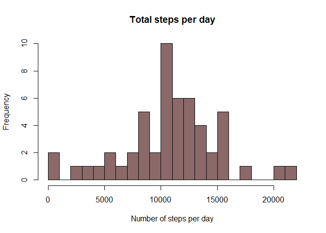
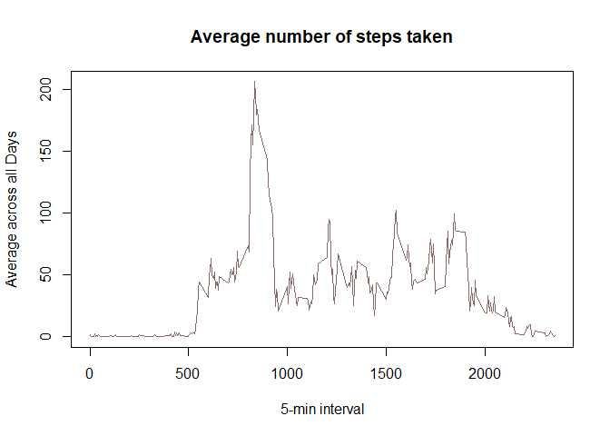
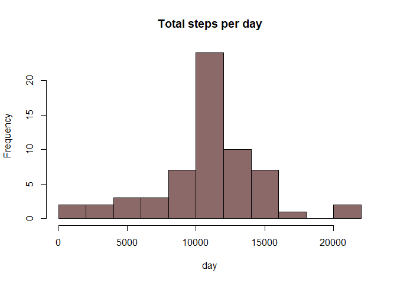
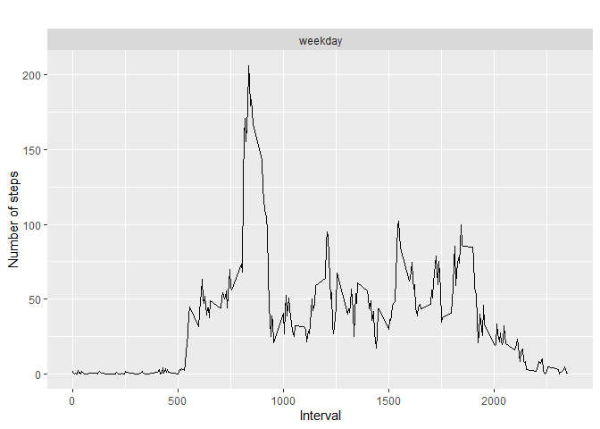

#**Reproducible Research Assignment**

## **Loading and preprocessing the data**


#### 1. Load the data (i.e. read.csv())

```r
## Loading and preprocessing the data
raw_data <- read.csv("./activity/activity.csv")
```

#### 2. Process/transform the data (if necessary) into a format suitable for your analysis


```r
# remove NA in data
data <- raw_data[ with (raw_data, { !(is.na(steps)) } ), ]
head(data)
```

```
##     steps       date interval
## 289     0 2012-10-02        0
## 290     0 2012-10-02        5
## 291     0 2012-10-02       10
## 292     0 2012-10-02       15
## 293     0 2012-10-02       20
## 294     0 2012-10-02       25
```

## **What is mean total number of steps taken per day?**

(For this part of the assignment, you can ignore the missing values in the dataset.)

1. Calculate the total number of steps taken per day  
2. If you do not understand the difference between a histogram and a barplot, research the difference between them. Make a histogram of the total number of steps taken each day  
3. Calculate and report the mean and median of the total number of steps taken per day

```r
dailysteps <- group_by(data, date)
daily_steps<- summarise(dailysteps, total = sum(steps))
```

```
## `summarise()` ungrouping output (override with `.groups` argument)
```

```r
head(daily_steps)
```

```
## # A tibble: 6 x 2
##   date       total
##   <fct>      <int>
## 1 2012-10-02   126
## 2 2012-10-03 11352
## 3 2012-10-04 12116
## 4 2012-10-05 13294
## 5 2012-10-06 15420
## 6 2012-10-07 11015
```


```r
hist(daily_steps$total, main="Total steps per day", 
     xlab="Number of steps per day", breaks=20, col="rosybrown4")
```

<!-- -->


```r
summary(daily_steps)
```

```
##          date        total      
##  2012-10-02: 1   Min.   :   41  
##  2012-10-03: 1   1st Qu.: 8841  
##  2012-10-04: 1   Median :10765  
##  2012-10-05: 1   Mean   :10766  
##  2012-10-06: 1   3rd Qu.:13294  
##  2012-10-07: 1   Max.   :21194  
##  (Other)   :47
```

```r
mean_daily_steps <- mean(daily_steps$total)
mean_daily_steps
```

```
## [1] 10766.19
```

```r
median_daily_steps <- median(daily_steps$total)
median_daily_steps
```

```
## [1] 10765
```
##### mean total steps per day is 10766.19 and the median is 10765

## **What is the average daily activity pattern?** 

1. Make a time series plot (i.e. **type = "l"**) of the 5-minute interval (x-axis) and the average number of steps taken, averaged across all days (y-axis)  
2. Which 5-minute interval, on average across all the days in the dataset, contains the maximum number of steps?  

```r
steps_interval <- aggregate(steps ~ interval, data, mean)
head(steps_interval)
```

```
##   interval     steps
## 1        0 1.7169811
## 2        5 0.3396226
## 3       10 0.1320755
## 4       15 0.1509434
## 5       20 0.0754717
## 6       25 2.0943396
```

```r
plot(steps_interval$interval, steps_interval$steps, type='l', 
     main="Average number of steps taken", xlab="5-min interval", 
     ylab="Average across all Days", col="rosybrown4")
```

<!-- -->
Which 5-minute interval, on average across all the days in the dataset, contains the maximum number of steps?


```r
max_interval <- which.max(steps_interval$steps)
steps_interval[max_interval,]
```

```
##     interval    steps
## 104      835 206.1698
```

The interval 835 has the maximun average value of steps which is 206.1698)

## **Imputing missing values**

Note that there are a number of days/intervals where there are missing values (coded as **NA**). The presence of missing days may introduce bias into some calculations or summaries of the data.

1. Calculate and report the total number of missing values in the dataset (i.e. the total number of rows with **NA**s)  
2.Devise a strategy for filling in all of the missing values in the dataset. The strategy does not need to be sophisticated. For example, you could use the mean/median for that day, or the mean for that 5-minute interval, etc.  
3.Create a new dataset that is equal to the original dataset but with the missing data filled in.  
4. Make a histogram of the total number of steps taken each day and Calculate and report the **mean** and **median** total number of steps taken per day. Do these values differ from the estimates from the first part of the assignment? What is the impact of imputing missing data on the estimates of the total daily number of steps?  

```r
### total number of missing values in the raw dataset
sum(is.na(raw_data))
```

```
## [1] 2304
```
Total number of missing value (**NA**s) is 2304  


So we now devise a strategy for filling in all of the missing values in the dataset.

```r
data_imputed <- raw_data
for (i in 1:nrow(data_imputed)) {
  if (is.na(data_imputed$steps[i])) {
    interval_value <- data_imputed$interval[i]
    steps_value <- steps_interval[
      steps_interval$interval == interval_value,]
    data_imputed$steps[i] <- steps_value$steps
  }
}
```

We create a new dataset that is equal to the original dataset but with the missing data filled in. We also make a histogram of the total number of steps taken each day and Calculate and report the mean and median total number of steps taken per day.  

```r
total_steps_per_day <- aggregate(steps ~ date, data = data_imputed, sum, na.rm = TRUE)

hist(total_steps_per_day$steps, main = "Total steps per day", xlab = "day", col = "rosybrown4", breaks=10)
```

<!-- -->

Do these values differ from the estimates from the first part of the assignment? What is the impact of imputing missing data on the estimates of the total daily number of steps?

```r
### Mean and Median if the new data set with filled NA's values
mean(total_steps_per_day$steps)
```

```
## [1] 10766.19
```

```r
median(total_steps_per_day$steps)
```

```
## [1] 10766.19
```

```r
### Mean and Median of the original data set
mean(daily_steps$total)
```

```
## [1] 10766.19
```

```r
median(daily_steps$total)
```

```
## [1] 10765
```

After replacing the missing values we can see that the mean is the same and the median is slightly different but not enought to be significant. 


## **Are there differences in activity patterns between weekdays and weekends?**
For this part the **weekdays()** function may be of some help here. Use the dataset with the filled-in missing values for this part.

1. Create a new factor variable in the dataset with two levels - "weekday" and "weekend" indicating whether a given date is a weekday or weekend day.  
2. Make a panel plot containing a time series plot (i.e. **type = "l"**) of the 5-minute interval (x-axis) and the average number of steps taken, averaged across all weekday days or weekend days (y-axis). See the README file in the GitHub repository to see an example of what this plot should look like using simulated data.  

```r
data_imputed["day_of_week"] <- weekdays(as.Date(data_imputed$date))
data_imputed$day_of_week[data_imputed$day_of_week  %in% c('Saturday','Sunday') ] <- "weekend"
data_imputed$day_of_week[data_imputed$day_of_week != "weekend"] <- "weekday"
```


```r
# convert type_of_day from character to factor
data_imputed$day_of_week <- as.factor(data_imputed$day_of_week)

# calculate average steps by interval across all days
steps_interval_dfimp <- aggregate(steps ~ interval + day_of_week, data_imputed, mean)

# creat a plot
qplot(interval, 
      steps, 
      data = steps_interval_dfimp, 
      type = 'l', 
      geom=c("line"),
      xlab = "Interval", 
      ylab = "Number of steps", 
      main = "") +
  facet_wrap(~ day_of_week, ncol = 1)
```

```
## Warning: Ignoring unknown parameters: type
```

<!-- -->


